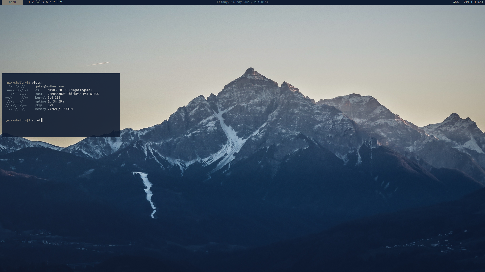

# NixOS Dotfiles *INCOMPLETE*



My *hopefully* up to date dotfiles. They may be up-to-date, or they may not be. Hopefully I will actually use the rough script I wrote...

Keep in mind, this setup keeps the following in mind:

- The laptop of choice is a Thinkpad P51 using hybrid graphics (Nvidia PRIME).
- Willingness to use the deprecated bumblebee option for Intel/Nvidia GPU power-management, over offloading due to incompatibility with my hardware.
- The `nix-dot` script assumes this repository is located at: `~/doc/nix-dot`, since I am too lazy to figure out auto-detection.

Use the script and files at your own risk! Try in a hypervisor before bare-metal if you are intent on using these files.

# Installing

To install this setup, run:

```
$ ./nix-dot down
$ ./nix-dot build
```

Or you can use the new flags:

```
$ ./nix-dot -d
$ ./nix-dot -b
```

# Updating and Commiting (for myself)

Run:

```
$ ./nix-dot up 
```

Or:

```
$ ./nix-dot -u
```

The home configuration also provides an alias for `~/doc/nix-dot/nix-dot` as `nd`. So for uploading, the command would become `nd up` or `nd -u`.

# License/Permissions

I do not care. Use, copy, or redistribute the code as you see fit. Just beware of incompatibilities with hardware/setups.
